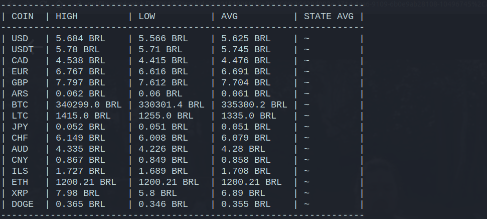

# Coin Viewer

Currency exchange updates every **30 seconds** directly at the terminal.

If desired, you can modify the currencies to be displayed and the currency for which the "translation" should take place. To do this, modify the `const.py` file:
- The `COINS_TO_SEARCH` constants are the currencies in which you want to view the current value. It is a list of currency abbreviations, the values that can be added are: `USD, CAD, AUD, EUR, GBP, ARS, JPY, CHF, CNY, YLS, BTC, LTC, ETH, XRP`.
- The constant `TARGET_COIN` is the currency for which the currencies to be searched for are to be calculated. You can assume the values `BRL, USD and EUR`

**The default values will display all possible currencies quoted in BRL.**
